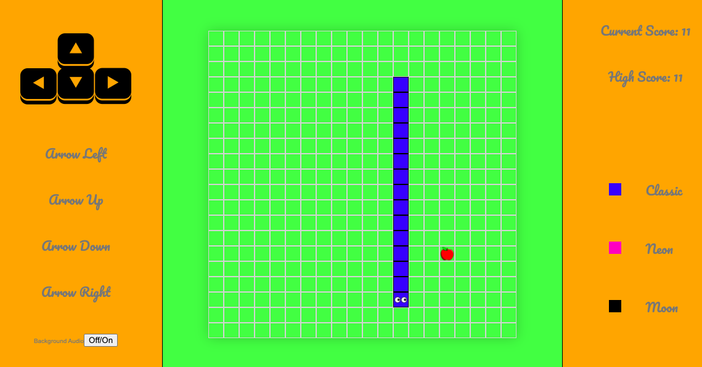

# SEI-Project-1

# Snake Game (5 days)

In this project, I was tasked with building a grid based game out of a list of options. This game had to be build using:

- HTML

- CSS

- Vanilla Javascript



 URL - https://bit.ly/3a1x3im


 ## General approach taken:

This project was my first attempt at coding a web application. After initially beign drawn to battleships and minesweeper as these were games I enjoyed I settled on doing snake. This seemed like a more balanced game than the others as the logic for informed computer decisions seemed very tough for me as I was very new to coding. Having carefully planned out how I would approach the games different requirements I began to implement them.

Having done the HTML first I began to place the snake on the screen. I was still deliberating whether to use an array for the whole snake or seperate the head and the body. I decided to to do it as a whole as I could still style the head differently and this seemed it would be easier to manage its movement. After getting it on the screen I set up the logic behind the time of the game. Every second the snake should move one square in whatever direction it was currently moving. Having got the snake moving left across the screen constantly I managed to set up the arrow keys to control movement. I then set the logic behind the gameover if it hit the side. 

Having got the basic's working I set about fixing some early bugs. The snake at this point could turn back on itself which it shouldn't be able to do. Here I was able to set up that logic that if the snakes direction was one way, the arrow key for its opposite direction would not affect the snake direction as seen bellow. Similarly I managed to get the snake eating itself to end the game by checking if there were any duplicate values in the snake array.

```javaScript
// Handling arrow key movements

function handleKeyUp(event) {

    switch (event.keyCode) {
      case 39: //arrow right
        if (currentDirection !== 'left') {
          currentDirection = 'right'
        }
        break
      case 37: //arrow left
        if (currentDirection !== 'right') {
          currentDirection = 'left'
        }
        break
      case 38: //arrow up
        if (currentDirection !== 'down') {
          currentDirection = 'up'
        }
        break
      case 40: //arrow down
        if (currentDirection !== 'up') {
          currentDirection = 'down'
        }
        break
    }
  }

}
``` 

I then set about the logic of eating. This was relatively simple as instead of popping the last item in the array as was done every second, when eating this was not needed. A problem with the food was getting it to generate on a square not currently in the snake array but like the endgame it was just a matter of checking the snake array on regeneration and with the food making sure it was placed on an unused square. 

```javaScript
// Handle game function

function startTimer() {
    let count = 0

    timerId = setInterval(() => {
      count ++
      removeSnakeClass(snakePosition)
      moveSnake(currentDirection)
      addSnakeClass(snakePosition)
      eyesMain()
      eatFood()
      updateScore()
      updateHighScore()
      updateTime(startTimer, timerId)
    }, time)

    startBtn.removeEventListener('click', startTimer)
  }

```

Having got the game logic working I set about creating the score and the logic behind resetting the game. Having then improved the styling of the page adding new color options for the game and adding audio I finally sorted a few bugs and delt with arrow scrolling on the page. This was a very fun first introduction to coding under time pressure, using intervals, selectors and event listeners and it was very good learning curve for vanilla JavaScript and was hugely beneficial for my development.

### Wins:

A big win was planning and implementing the logic behind moving the snake. By using the keys to set the current direction of the snake I could then deal with manipulating arrays and changing classes knowing the next position of the snake. 
 
 
### Key Learning:

Key learning included functions, keycodes, classes, arrays, selectors and event listeners.

### Future Features:

If i had more time I would like to have used local storage to set the high score as while it works when using the app, upon refreshing the screen or revisiting the site this data is lost. I would also refactor the existing code as I was largely focusing on bug fixing and styling towards the end so didn't have time to do this.


